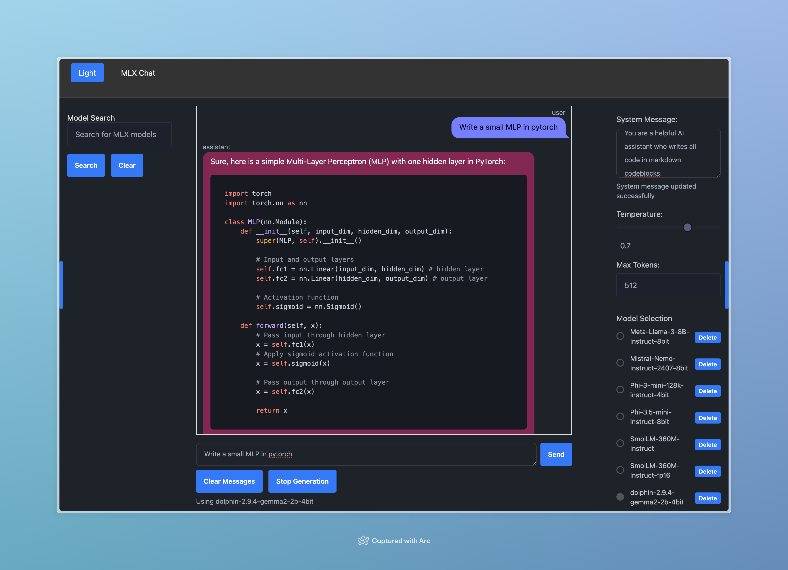

# MLX Chat

MLX Chat is an AI chatbot interface using MLX and FastHTML.



## Features

- MLX for LLM inference on Apple silicon
- FastHTML user interface
- Multiple AI model options
- Adjustable temperature and max tokens
- Conversation history
- Dark and light theme

## Installation

1. Clone the repository:
   ```
   git clone https://github.com/yourusername/mlx-chat.git
   cd mlx-chat
   ```

2. Install the package and its dependencies:
   ```
   pip install -e .
   ```

## Running the Application

To run MLX Chat, use the following command from the terminal:
```
mlx_chat
```

## Usage

1. Select an AI model
2. Set temperature and max tokens
3. Type your message
4. Send and view the AI's response

## MLX and FastHTML

MLX Chat uses MLX for on device LLM inference and FastHTML for the user interface.

## Controls

- Clear Messages
- Stop Generation
- Light/Dark Mode
- Model Search
